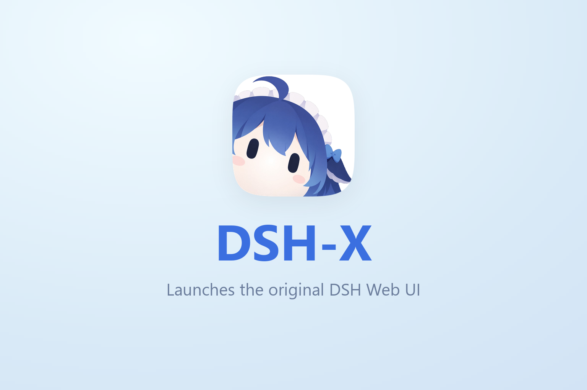
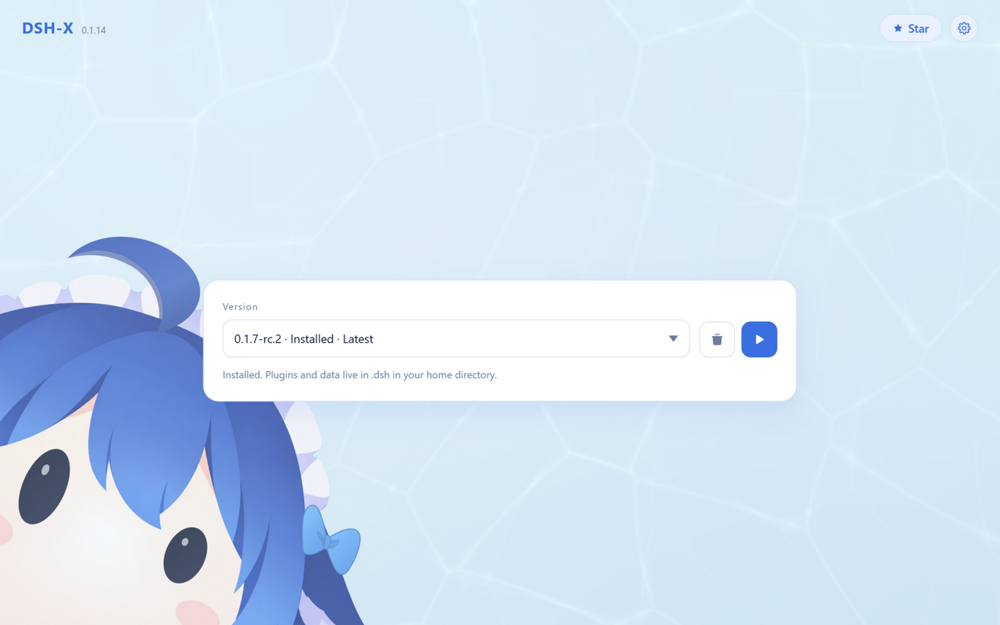
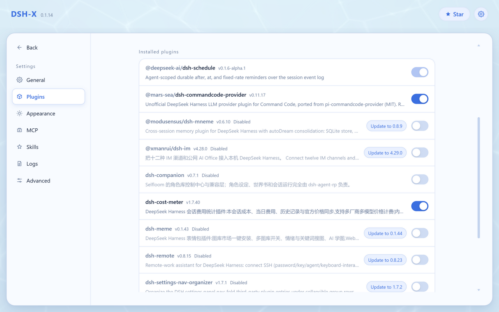
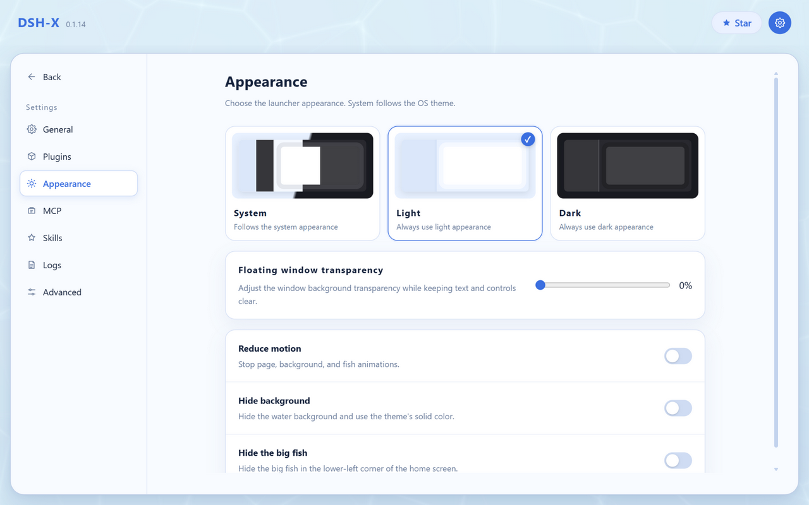

<p align="center">
  
</p>

<p align="center">
  <a href="https://cavanluo666.github.io/DSH-X-offline/">Website</a>
  ·
  <a href="https://github.com/cavanluo666/DSH-X-offline">Star</a>
  ·
  <a href="README.md">中文</a>
</p>

An offline launcher for DeepSeek Harness. Install it and go — no network needed.

> [!IMPORTANT]
> **DSH-X starts DeepSeek Harness's own web page.**  
> It only handles launching and plugin management and never modifies or rewrites DSH's web UI. DSH-X is a community project, not an official DeepSeek product.
>
> **This is the offline build**: it ships its own Node runtime, the dsh core, bundled plugins and a pnpm cache, so the target machine never talks to the network.
> Everything that used to require one — fetching versions, the plugin marketplace, self-update, sync, proxies — has been removed.

## Features

- **Install and go**: the package carries the dsh core, so it starts right away with no download wait
- **Fully offline**: plugins install as local dependencies and pnpm uses the shipped corepack cache — not a single request goes out
- **Plugins page**: list installed plugins and toggle each with one click; switch profiles here too
- **Modpacks**: install a batch of plugins and their config in one go (one recommended pack is built in, or use a local file) — see the Modpacks section below
- **Compatibility mode**: on a failed start, disable the plugins named in the error (one click to restore); after boot it checks the client plugin bundles that the page references and reports the verdict, telling a broken install apart from a stale tab
- **Dark appearance**: follow the system or pick a theme, plus floating-panel transparency and mascot switches
- **Faster startup**: equivalent fast implementations at the bundle composition point (saves about 1–2 s), skipped automatically once dsh changes underneath
- **Data stays in your user directory**: sessions and plugins live in `.dsh`; uninstalling or reinstalling the launcher never touches them
- **Resident in the background**: closing the page does not quit (Windows tray / macOS menu bar icon); the UI uses your system browser
- **Bundled Node / npm / pnpm**: a portable runtime ships inside the package, and plugin installs need nothing from the host system
- **Run several profiles at once**: one instance per profile, each on the port it picked (data in `.dsh` is shared anyway); open and stop them one by one on the control page. To keep one address across restarts, pin a port to a version × profile (applies on the next start)

Feedback: **QQ group [993579665](https://qm.qq.com/q/7AD2g70HqS)**

## What the offline build removed

These all needed the network. They are gone wholesale — listed here so a missing button does not read as a bug.

| Removed | Why | What to do instead |
| --- | --- | --- |
| Version install / update check | versions came from npm | the package carries one dsh core; to change versions, install a different package |
| Plugin updates | needed the registry for versions and tarballs | plugins ship with the package; upgrading means a new package |
| Launcher self-update | downloaded the installer from GitHub | download a new package and install over it |
| Community market (modpacks) | both the index and the packs live on GitHub | the built-in recommended pack plus local `.dspack` files |
| Agent sync (S3 / WebDAV) | its whole job was shipping data to a remote | data stays local; back up by copying `.dsh` |
| Network proxy | there are no outbound requests left to proxy | — |

## Modpacks

Install a batch of plugins and their config in one go — no installing one by one and hand-editing files. Every modpack is a card on the Plugins page: **one card is one profile** (which is exactly what installing a pack produces), profiles you assembled by hand show up too, and click one to see the plugins in that profile, each still toggleable on its own. The format is the ecosystem's [DSH-PackForge](https://github.com/DSH-PackForge/DSH-PackForge) `.dspack` (manifest v5, older versions accepted), so packs are interchangeable with other launchers.

- **Where from**: a local `.dspack` file, or the recommended pack built into the repo (one click on the page, it ships with the package).
- **Where to**: a profile of its own by default, so your current setup is untouched — or point it at an existing profile such as `web`. Switch to it and restart from the same page.
- **You see it first**: layers, dependencies, files to write, what gets overridden, and what in the pack will not be installed (credentials, `.npmrc` and machine-wide settings never land on disk). Nothing happens before you confirm.
- **You can get back**: files it overwrites are backed up first, a failed install rolls back, removing a pack restores your files, and a profile the pack created can be deleted along with it.
- **Share your own**: export the current profile as a `.dspack` (pinned dependencies + patch layer + config files, never `node_modules` or credentials), and whoever installs it gets the same plugin setup.

The repo ships one: [**`packs/dsh-x-recommended`**](packs/dsh-x-recommended/README.md) — DSH-X's own starter set: the memory plugin (`dsh-x-memory`) and the config-manager plugin (`dsh-config-manager`).

## Screenshots

<p align="center">
  
</p>

<p align="center">
  
</p>

<p align="center">
  
</p>

## Antivirus false positives

The launcher is unsigned and spawns `cmd` / `powershell`, can register itself to start at login and carries a Node runtime (older builds also downloaded an installer), so Windows Defender or another antivirus occasionally flags it.

If that happens, add the install directory (default `%LOCALAPPDATA%\Programs\DSH`) to the exclusions; you can report the false positive to [Microsoft](https://www.microsoft.com/en-us/wdsi/filesubmission) (pick "software developer", upload `DSH-Setup.exe`) and it is usually cleared in 1–2 days. Same for Chinese antivirus products (360, Huorong). A SmartScreen "unknown publisher" warning after download is expected — click "Run anyway".

## Usage

Windows: download `DSH-Setup.exe`, install, then open **DSH-X** from the desktop.

macOS: open `DSH-X-mac-arm64.dmg` (Apple Silicon) or `DSH-X-mac-x64.dmg` (Intel) and drag **DSH-X** into Applications. The app is not notarised, so right-click → Open the first time. Settings and logs live in `~/Library/Application Support/DSH`.

Both the manager page and the dsh UI open in your system browser. The manager page defaults to `http://127.0.0.1:3780/` (change the port in Settings). To reach dsh from a phone or another computer: Settings → Advanced → **Web binding** → "LAN", effective on the next dsh start.

Checking a download (optional): every file on the release page lists its sha256 — Windows `certutil -hashfile DSH-Setup.exe SHA256`, macOS `shasum -a 256 DSH-X-mac-arm64.dmg`.

## Development

Node.js 22.18+ is required. After `npm install`, run `npm start`; for the web server alone, `npm run server`.

Running from source has no `core/` or `node/` (those are the offline payload inside the package), so "install the built-in version" reports an error on purpose — use a locally installed dsh to exercise the launch path.

## Packaging

```sh
npm run dist
```

On Windows (needs Rust and **NSIS 3.x**) this produces the portable `release/DSH/` directory and `release/DSH-Setup.exe`; on macOS (needs Rust and the Xcode command line tools) it produces `release/DSH-X.app` and `release/DSH-X-mac-<arch>.dmg` (Intel: `DSH_MAC_ARCH=x64 npm run dist`).

If NSIS is not installed: `choco install nsis`, or point the `MAKENSIS` environment variable at `makensis.exe`.

**The build machine must have three payload sources ready**, or the package will not run on another machine:

| Payload | Where it comes from | What happens without it |
| --- | --- | --- |
| `core/dsh` (the dsh core) | the `@deepseek-ai/dsh` installed on the build machine, or the directory `DSH_CORE_SOURCE` points at | the build fails outright, telling you to run `npm i -g @deepseek-ai/dsh` |
| `corepack/` (pnpm cache) | the build machine's `COREPACK_HOME` (default `%LOCALAPPDATA%\node\corepack`) | a warning only; the first plugin install on the target machine would download pnpm |
| `packages/` (bundled plugins) | the repo's `plugins/` | no bundled plugins to install |

The signing key lives at `release/release-key.pem` (gitignored, **back it up**). The header comments of `scripts/release-manifest.mjs` cover keygen and verifying a single directory.

## License

This project is a derivative work of the upstream [DSH-X](https://github.com/yyh-001/DSH-X) by yyh:

```
Copyright (C) 2026 LCH          (changes in this version)
Copyright (C) 2026 yyh          (original project)
```

Released under the **GNU General Public License v3.0 or later**; see [`LICENSE`](LICENSE)
for the full terms. The upstream project was released under MIT, and its notice is preserved
in full in [`NOTICE.md`](NOTICE.md) and [`LICENSE`](LICENSE).

The `plugins/` directory bundles third-party plugins that keep their own licenses (all MIT);
see [`NOTICE.md`](NOTICE.md) for details.

This program is free software: you can redistribute it and/or modify it under
the terms of the GNU General Public License as published by the Free Software
Foundation, either version 3 of the License, or (at your option) any later
version.
