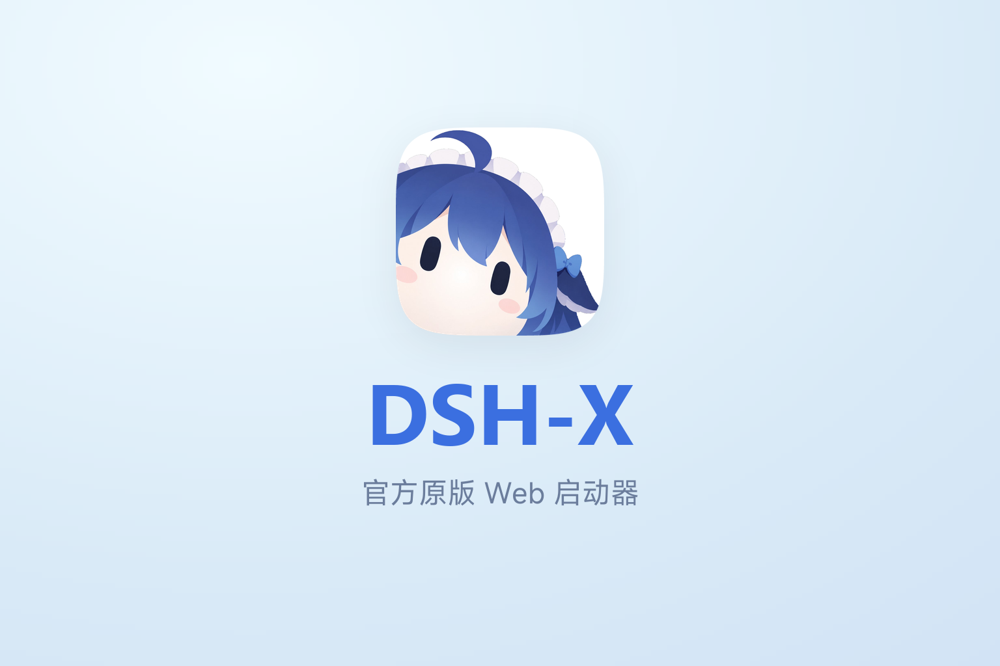
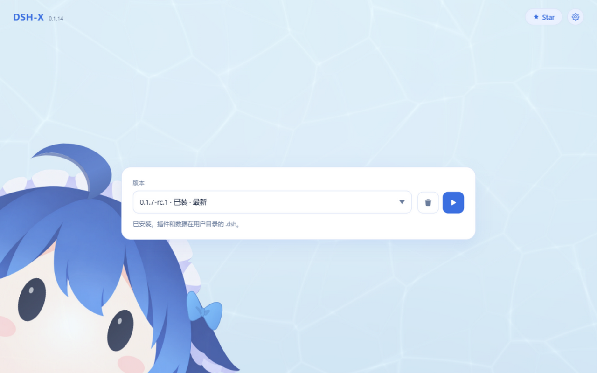
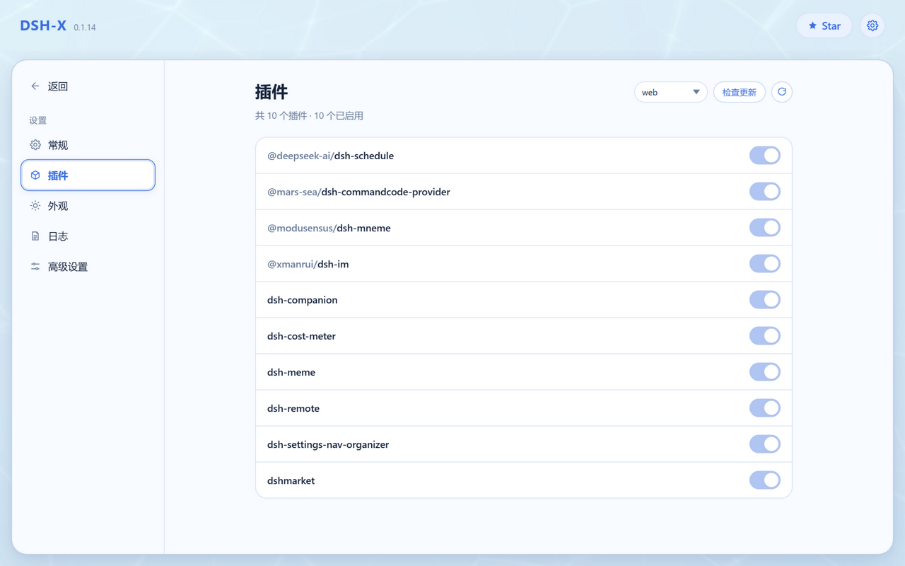
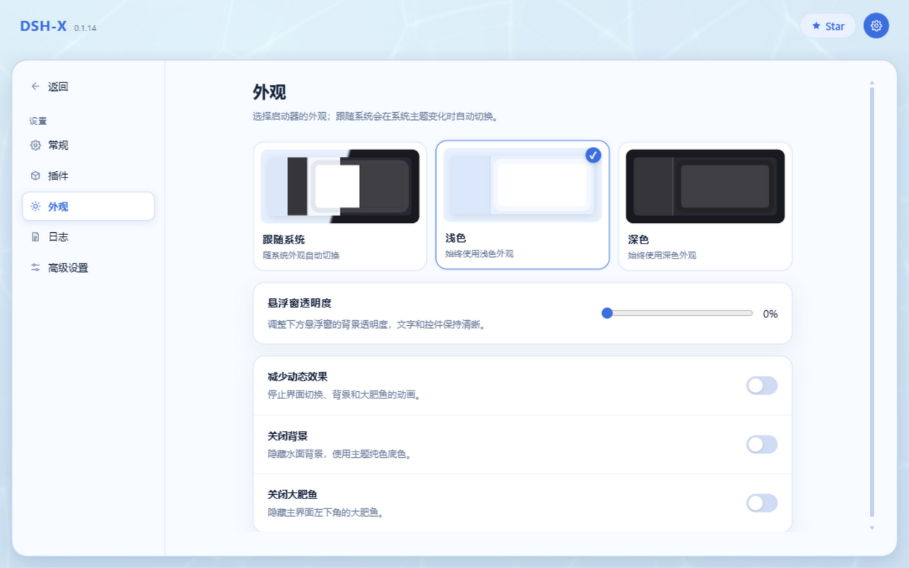

<p align="center">
  
</p>

<p align="center">
  <a href="https://cavanluo666.github.io/DSH-X-offline/">主页</a>
  ·
  <a href="https://github.com/cavanluo666/DSH-X-offline">Star</a>
  ·
  <a href="README.en.md">English</a>
</p>

DeepSeek Harness 离线启动器。装完即用，不需要联网。

> [!IMPORTANT]
> **DSH-X 启动的是 DeepSeek Harness 官方原版 Web 页面。**  
> 它只负责启动和插件管理，不修改也不重做 DSH 的网页界面。DSH-X 本身是社区开源项目，并非 DeepSeek 官方产品。
>
> **这一版是「离线版」**：自带 Node 运行时、dsh 本体、内置插件与 pnpm 缓存，装机器上全程不联网。
> 原来那些要联网的功能（拉版本、插件市场、自更新、同步、代理）已全部去掉。

## 功能

- **装完即用**：安装包自带 dsh 本体，装上就能启动，不用联网等下载
- **全程离线**：插件以本地依赖装进 profile，pnpm 用随包的 corepack 缓存，一个请求都不发出去
- **插件页**：列出已装插件一键开关，profile 也在这里切换
- **整合包**：一次装好一批插件和它们的配置（内置一份推荐包，也可从本地文件装），细节见下面「整合包」一节
- **兼容模式**：启动失败按报错自动禁用出问题的插件（可一键恢复）；启动后自检页面引用的客户端插件包，管理页给出结论（区分实例问题和旧标签页）
- **深色外观**：跟随系统或手动指定，另有悬浮窗透明度与看板娘开关
- **启动加速**：在 bundle 合成处挂等价快实现（约省 1–2 秒），dsh 升级后自动跳过
- **数据在用户目录**：`.dsh` 里放着会话与插件，卸载或重装启动器都不会动它
- **常驻后台**：关掉网页不退出（Windows 托盘 / macOS 菜单栏图标），界面走系统浏览器
- **自带 Node / npm / pnpm**：便携运行时随包发，插件安装不依赖系统环境
- **可以同时跑几个 profile**：一个 profile 一个实例、各挑各的端口（数据在 `.dsh` 里本来就共享），控制页上逐个打开 / 停止；想让地址每次都一样，可以按「版本 × profile」把端口钉死（下次启动生效）

交流 / 反馈：**QQ 群 [993579665](https://qm.qq.com/q/7AD2g70HqS)**（[点击加入](https://qm.qq.com/q/7AD2g70HqS)）

## 离线版去掉了什么

这些功能原来都要联网，现在整块撤了。写明在这里，免得看到界面少了东西以为是坏了。

| 去掉的 | 为什么 | 现在怎么办 |
| --- | --- | --- |
| 选版本安装 / 检查更新 | 版本要从 npm 拉 | 安装包只带一个 dsh 本体；要换版本就换一份安装包 |
| 插件在线更新 | 要从 registry 比版本、下包 | 插件随安装包发；升级同样靠换包 |
| 启动器自更新 | 要从 GitHub 下安装包 | 手动下载新安装包覆盖安装 |
| 社区市场（整合包） | 索引与包都在 GitHub 上 | 内置推荐包 + 本地 `.dspack` 文件 |
| Agent 同步（S3 / WebDAV） | 本来就是把数据传到远端 | 数据只留在本机；要备份就手动复制 `.dsh` |
| 网络代理 | 没有外网请求可代理 | —— |

## 整合包

一次装好一批插件和它们的配置，不用一个个装、一条条改。整合包在插件页里一张卡一个——**一张卡就是一份 profile**（装完整合包，产物正是它），手动拼出来的 profile 也在列表里，点进去能看到这份 profile 里的插件，每个还能单独开关。格式用生态里的 [DSH-PackForge](https://github.com/DSH-PackForge/DSH-PackForge) `.dspack`（manifest v5，兼容旧版本），和其他第三方启动器的包互通。

- **从哪装**：本地 `.dspack` 文件，或仓库内置的那份推荐包（页面上直接点，随安装包发）。
- **装到哪**：默认装进一个独立的 profile，和现有环境互不打扰；也可以改成 `web` 之类现有 profile 并进去，装完在页面上切过去并重启。
- **装之前先说清**：层栈、依赖、要写的文件、会覆盖什么、包里有哪些内容不会装（凭据、`.npmrc`、整机设置这些一律不落盘）。确认了才动手。
- **出错能退回来**：安装前备份被覆盖的文件，装失败自动回滚，卸载时还原；包自建的 profile 可以连目录一起删掉。
- **自己也能发一个**：把当前 profile 导出成 `.dspack`（钉版依赖 + 补丁层 + 配置文件，不含 `node_modules` 与凭据），别人装上就是同样的插件环境。

仓库里自带一份 [**`packs/dsh-x-recommended`**](packs/dsh-x-recommended/README.md)（DSH-X 挑的一套开箱插件：记忆插件 `dsh-x-memory` 与配置管理插件 `dsh-config-manager`）。

## 界面预览

<p align="center">
  
</p>

<p align="center">
  
</p>

<p align="center">
  
</p>

## 杀软误报

启动器没有代码签名，会拉起 `cmd` / `powershell`、能写开机自启、自带 Node 运行时（旧版还会下载安装包），所以偶尔会被 Windows Defender 或其他杀软拦下。

被拦了：把安装目录（默认 `%LOCALAPPDATA%\Programs\DSH`）加进排除项；误报可以提交给[微软](https://www.microsoft.com/en-us/wdsi/filesubmission)（选「软件开发者」，上传 `DSH-Setup.exe`），一般 1–2 天撤销，国内杀软（360、火绒等）同理。下载后 SmartScreen 提示「未知发布者」是正常的，点「仍要运行」。

## 使用

Windows：下载 `DSH-Setup.exe` 安装，从桌面打开 **DSH-X**。

安装向导会让你选两件事：

| 选项 | 说明 |
| --- | --- |
| **仅为我安装**（默认） | 装到 `%LOCALAPPDATA%\Programs\DSH-X`，写 HKCU，**不需要管理员、不弹 UAC**。 |
| **为所有用户安装** | 装到 `C:\Program Files\DSH-X`，写 HKLM，**需要管理员（会弹 UAC）**。 |
| **开始菜单快捷方式** | 默认勾选。 |
| **桌面快捷方式** | 默认勾选。 |

不管选哪种，**用户数据都不在安装目录里**：配置在 `%APPDATA%\DSH`，会话在 `%DSH_HOME%`（默认 `~/.dsh`）。卸载只删程序自己装的东西，这两处一律保留，重装后接着用。

静默安装（脚本批量部署）时可以显式指定：

```bat
DSH-Setup.exe /S /CurrentUser        :: 仅为我，免 UAC
DSH-Setup.exe /S /AllUsers           :: 为所有用户，需管理员
```

macOS：打开 `DSH-X-mac-arm64.dmg`（Apple Silicon）或 `DSH-X-mac-x64.dmg`（Intel），把 **DSH-X** 拖进「应用程序」。应用没做公证，第一次打开要右键选「打开」。设置和日志在 `~/Library/Application Support/DSH`。

管理页和 dsh 的界面都在系统浏览器里打开，管理页默认 `http://127.0.0.1:3780/`（端口可在设置页改）。想让手机或其他电脑访问 dsh：设置页 → 高级设置 → **Web 绑定**选「局域网」，下次启动 dsh 生效。

核对下载到的包（可选）：Release 页面每个文件旁边有 sha256，本地对一下即可 —— Windows `certutil -hashfile DSH-Setup.exe SHA256`，macOS `shasum -a 256 DSH-X-mac-arm64.dmg`。

## 开发

本机需要 Node.js 22.18+。`npm install` 之后 `npm start`；只起网页用 `npm run server`。

源码运行时没有 `core/` 与 `node/`（那是安装包里的离线载荷），所以「安装内置版本」这一步会明确报错——开发时用本机已装的 dsh 验证启动链路即可。

## 打包

```sh
npm run dist
```

Windows（需要 Rust 与 **NSIS 3.x**）产出 `release/DSH/` 便携目录和 `release/DSH-Setup.exe`；macOS（需要 Rust 与 Xcode 命令行工具）产出 `release/DSH-X.app` 和 `release/DSH-X-mac-<arch>.dmg`（Intel 版：`DSH_MAC_ARCH=x64 npm run dist`）。

没装 NSIS 的话：`choco install nsis`，或用 `MAKENSIS` 环境变量指到 `makensis.exe`。

**Rust 工具链要用 MSVC 那一套**（`stable-x86_64-pc-windows-msvc`，配合 Visual Studio Build Tools 的「使用 C++ 的桌面开发」工作负载）。

> 别用 GNU 工具链（`x86_64-pc-windows-gnu`）：它在本机实测编不过 `cargo build --release` ——
> 链接阶段 `dlltool.exe` 会以 `CreateProcess` 失败（Rust 自带的那个 self-contained dlltool
> 内部要再拉别的 GNU 程序，缺件），报错是 `dlltool could not create import library`。
> 只跑 `cargo check` 看不出来（它不链接），一 `--release` 就炸。

**打包机要先准备好三样离线载荷**，否则打出来的包装到别的机器上转不起来：

| 载荷 | 从哪来 | 缺了会怎样 |
| --- | --- | --- |
| `core/dsh`（dsh 本体） | 打包机上装过的 `@deepseek-ai/dsh`，或 `DSH_CORE_SOURCE` 指的目录 | 直接打包失败，提示先 `npm i -g @deepseek-ai/dsh` |
| `corepack/`（pnpm 缓存） | 打包机的 `COREPACK_HOME`（默认 `%LOCALAPPDATA%\node\corepack`） | 只警告；装机器上首次装插件会联网下 pnpm |
| `packages/`（内置插件） | 仓库的 `plugins/` | 没有内置插件可装 |

### 内置 WebView2 运行时（可选）

`DSH.exe` 的内嵌窗口用 WebView2。Windows 11 和较新的 Win10 一般都预装了它，但旧镜像、LTSC、被精简过的系统上未必有——缺了它窗口建不出来，界面只能退回系统浏览器。装一份固定版本运行时进安装包就彻底不依赖机器上装过什么：

```sh
# 方式一：指定官方 CAB（或已经解开的目录）
set DSH_WEBVIEW2=path\to\Microsoft.WebView2.FixedVersionRuntime.133.0.3065.92.x64.cab

# 方式二：让打包脚本自己下（约 243 MB，只下一次，之后缓存在 vendor/）
set DSH_WEBVIEW2_DOWNLOAD=1

npm run dist
```

代价是体积：官方 CAB 243.5 MB，解开 **557.4 MB / 168 个文件**，整包从约 60 MB 涨到 **183 MB**（LZMA 压缩后）。不需要内嵌窗口的话（界面走系统浏览器）不带它就行，安装程序会在日志里说明「这一份不带，将使用系统已安装的那份」。

安装后运行时落在 `<安装目录>\webview2`，`DSH.exe` 启动时通过 `WEBVIEW2_BROWSER_EXECUTABLE_FOLDER` 指过去，完全不碰系统里那份 Evergreen。用户自己设过这个环境变量时不覆盖。

私钥在 `release/release-key.pem`（已被忽略、不进仓库，**务必备份**）。`scripts/release-manifest.mjs` 的头部注释里有 keygen、单独核对某个目录等其余用法。

## 许可证

本项目是上游 [DSH-X](https://github.com/yyh-001/DSH-X)（作者 yyh）的衍生作品：

```
Copyright (C) 2026 LCH          （本版本的修改）
Copyright (C) 2026 yyh          （原始项目）
```

以 **GNU General Public License v3.0 or later** 发布，完整条款见 [`LICENSE`](LICENSE)。
上游原始项目以 MIT 发布，其声明已完整保留在 [`NOTICE.md`](NOTICE.md) 与 [`LICENSE`](LICENSE) 中。

`plugins/` 目录下内含若干第三方插件，各自保留原许可证（均为 MIT），详见 [`NOTICE.md`](NOTICE.md)。

This program is free software: you can redistribute it and/or modify it under
the terms of the GNU General Public License as published by the Free Software
Foundation, either version 3 of the License, or (at your option) any later
version.
